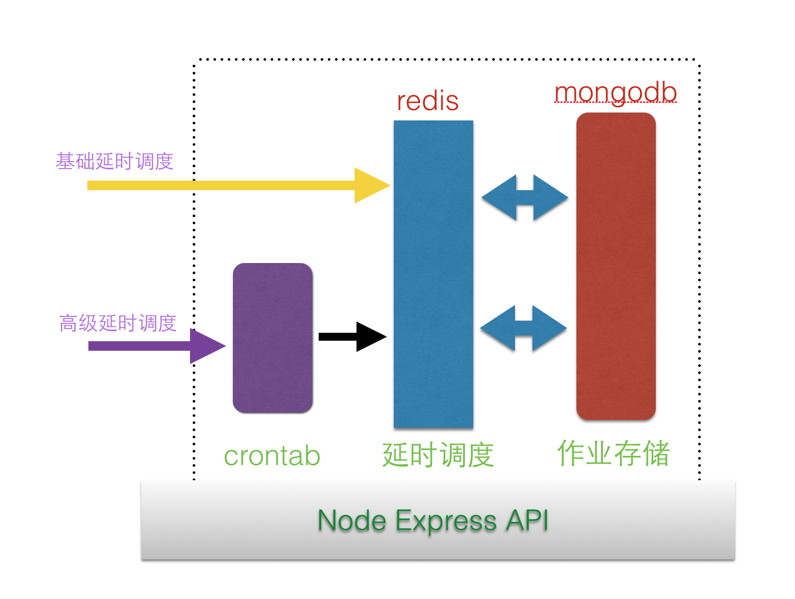

# node-cron

## 关于调度

最早的调度应用是unix的crontab。


首先看一下job作业可能有哪些？

最典型的执行脚本，perl脚本，shell或bat脚本，java脚本，plsql这类封装多个或一个sql的脚本。

其次执行SQL或存储过程

可能还有一些文件操作，比如创建和删除文件或目录。在数据清洗，断点回复和日志维护的时候是非常有用的。

对于系统管理员来讲，最好的工具可能是shell和perl了，最短的代码完成最多功能。而且很多东西不要模块化。

比较经典的应用是ETL里的调度

ETL，是英文 Extract-Transform-Load 的缩写，用来描述将数据从来源端经过抽取（extract）、转换（transform）、加载（load）至目的端的过程。ETL一词较常用在数据仓库，但其对象并不限于数据仓库,是构建数据仓库的重要一环，用户从数据源抽取出所需的数据，经过数据清洗,最终按照预先定义好的数据仓库模型，将数据加载到数据仓库中去。（扯多了）


举个典型的例子，oauth token是有超时时间限制的，比如微信就是7200s超时

那我们应该怎么做呢？


## 可实现方式

- cron(精度较低，到分钟)
- 使用redis特性(精度高，毫秒级别)

## cron

cron是一个linux下的定时执行工具，可以在无需人工干预的情况下运行作业。

Cron表达式是一个字符串，字符串以5或6个空格隔开，分为6或7个域，每一个域代表一个含义，Cron有如下语法格式： 

- 分钟　（0-59） 
- 小時　（0-23） 
- 日期　（1-31） 
- 月份　（1-12） 
- 星期　（0-6）//0代表星期天

它的问题是：精度较低，到分钟，这对很多高精度的作业来说比较郁闷的，系统管理还好。

如果不了解这方面内容，可以看看linux cron方面的东西

btw：java里有Quartz调度，精度也是分钟

## later.js是nodejs版本的一个比较好的cron实现

A javascript library for defining recurring schedules and calculating future (or past) occurrences for them. Includes support for using English phrases and Cron schedules. Works in Node and in the browser.

Types of schedules supported by Later:

- Run a report on the last day of every month at 12 AM except in December
- Install patches on the 2nd Tuesday of every month at 4 AM
- Gather CPU metrics every 10 mins Mon - Fri and every 30 mins Sat - Sun
- Send out a scary e-mail at 13:13:13 every Friday the 13th

完整文档：http://bunkat.github.io/later/

## 利用redis

Keyspace Notifications这个特性是在Redis 2.8+才又得特性。


### 启动redis

一定要注意redis启动方式，开启 Keyspace Notifications

```
nohup redis-server  --notify-keyspace-events Ex  --loglevel verbose >./redis-server.log 2>&1 &
```


### node.js调用实例


```
	var redis = require("redis"),
 
	// 创建一个用于订阅通知的client
	subscriberClient = redis.createClient(),
 
	// 创建一个用于存放调度的队列的client 
	schedQueueClient = redis.createClient();
 
	// 当收到一条送到的消息...
	subscriberClient.on("pmessage", function (pattern, channel, expiredKey) {
	    console.log("key ["+  expiredKey +"] has expired");
 
	    //TODO: push expiredKey onto some other list to proceed to order fulfillment
 
	    subscriberClient.quit();
	});
 
	// subscribe to key expire events on database 0
	subscriberClient.psubscribe("__keyevent@0__:expired");
 
	// schedule ORDER_ID "order_1234" to expire in 10 seconds
	schedQueueClient.set("order_1234", "", "PX", 10000, redis.print);
	schedQueueClient.quit();

```

说明：order_1234会在10s钟后过期，过期后在`on("pmessage"`事件里能够捕获

还有另外一种做法是pub/sub，能实现此效果，但精准度差的多

## redis expire

oauth token是有超时时间限制的，比如微信就是7200s超时

那我们应该怎么做呢？

给出原理部分代码`client.expire(k, 1*60);`

```

function cache_expire(k, v){
  console.log('============= cache_expire ==============');
  if(client){
    client.set(k, v, redis.print);
    // Expire in 1*60 seconds
    client.expire(k, 1*60);
  }else{
    console.log('redis client instance is not exist.');
  }
}

```

更多见https://github.com/tangramor/wx_jsapi_sign


## 给出一个实战例子

- express（API）
- redis（任务调度）
- mongodb（存储任务）

## 原理

增加调度，等触发调度的时候，对外发送请求，这样就能够做到通用了




### 阶段1：根据时间，实现基础的延时调度

使用redis特性，实现基础延时调度

### 阶段2：引入crontab一样的表达式，支持更多调度

https://github.com/bunkat/later

此时的任务，会发给阶段1的基础延时调度来处理

### 阶段3：触发之后放到队列里，对外发送http请求

此处可以负载

### 总结

通过3个阶段的处理，可以完成大规模的部署


## Table

- _id
- time
- desc
- callback_url
- is_finished
- create_at

情景

2014-11-11 11：10 财神给小墨发送消息

## todo

- [ ] 增加一个调度
- [ ] 移除一个调度
- [ ] 获取调度列表
- [ ] 查看调度详情

## 技术点

- https://github.com/i5ting/redis-scheduler
- http://momentjs.com/
- https://github.com/mikeal/request/


欢迎关注我的公众号【node全栈】  


